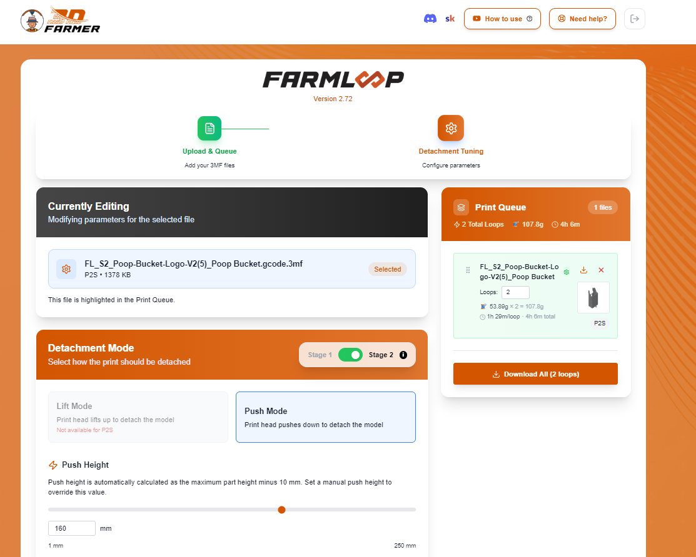

# Incident report: the FarmLoop Pro app's G-code idles a hot printer for hours

**TLDR:** I bought the FarmLoop Stage 2 kit for hands-off printing on my Bambu Lab P2S. The G-code the FarmLoop Pro app (v2.72) produced for me contains a two-hour "natural cooldown" wait in the **start** of every loop, before the print begins, with the heaters on and the fans off. I saw it on two different models. On the first, the printer stalled and I ran it for about 30 minutes before cutting power.

This repo exists because software sold for *unattended* printing has to produce G-code that is safe when nobody is watching, and I could not rely on that.

> **DRAFT:** items marked **TODO** need your own confirmation, screenshots or files before publishing.

---

## What I am and am not claiming

**Claiming (verified from the files):**

- The processed files contain the block shown below, in the start sequence, once per loop.
- The block's own comment says it is meant to run before the door opens, which is post-print logic.
- The heaters are left on and the fans are switched off while it runs.
- This is what the app gave me on two different models. 

**Not claiming:**

- That the vendor intended this, or knew about it.
- That every file, printer model or app version has the problem. I only tested a P2S with app v2.72.
- That my printer was permanently damaged.

The app itself tells users they use it at their own risk. This report is about what that risk looked like in practice.

---

## Timeline

Dates are approximate.

| When | What happened |
|---|---|
| Aug 2026 | Bought and installed the FarmLoop Stage 2 hardware for the P2S. |
| Sep 6 | Ran the first processed file (File A). About 5 minutes in, after the AMS filament step, the printer stopped making progress. I let it run about 30 minutes, then cut power and inspected the machine. |
| Sep 7–8 | Unzipped File A and a plain slice of the same model and diffed them. Found the cooldown block. |
| Sep 19 | Processed a new, unrelated model (File B) in the app. **The same block is present.** I did not run it. |


---

## This is the app's default output

Both files came straight out of the app's **Process Gcode** step. I did not edit them, rename them or re-save them in a slicer.

Settings visible in File B's G-code:

| Setting | Value in the file |
|---|---|
| Printer | P2S |
| Detachment | Push Mode (the only mode available on the P2S) |
| Loops | 2 |
| Bed temperature | 55 °C |
| Post-print cooldown | Temperature-based, target 26 °C |

Screenshots of the **Detachment Tuning** page for File B, taken before clicking Process Gcode, confirm these match what was on screen — Push Mode, 55 °C bed, and a temperature-based cooldown targeting 26 °C:




**Beta features were off** (see the toggle in the app's footer, bottom right of the second screenshot). Nothing here came from an experimental or opt-in feature — Push Mode, temperature-based cooldown, and the bed/Z-offset tuning are all part of the app's regular, out-of-beta feature set. This is the G-code the app's stable, promised functionality produces.

---

## What the G-code does

Excerpt from the processed file. The repeated dwell lines are elided:

```gcode
; ================ FL NATURAL COOLDOWN ================
; Hold in the closed chamber for 120 min before the door opens.
; Fans off so the part cools evenly instead of from one side — ASA, ABS
; and PC warp and split when cooled fast while still stuck to the plate.
M106 S0          ; part cooling fan off
M106 P2 S0       ; auxiliary fan off
M106 P3 S0       ; chamber fan off
G4 S30
G4 S30
... (240 x G4 S30 in total)
; ================ FL NATURAL COOLDOWN END (120 min) ================
M104 S220
```

`G4 S30` is a 30-second dwell. 240 of them is 7,200 seconds, or 2 hours.

| | File A | File B |
|---|---|---|
| Loops | 2 | 2 |
| Dwells per loop | 240 x `G4 S30` (2 h) | 240 x `G4 S30` (2 h) |
| Total wait before printing | About 4 h | About 4 h |
| Fans during the wait | Off | Off |
| What follows the block | `M104 S220` (heat to print temperature) | `M104 S220` |

### Why this is a defect

1. **It is in the wrong place.** The comment describes a post-print hold ("before the door opens"), but the block runs before printing starts.
2. **The heaters stay on.** In File B, the start sequence sets the bed to 55 °C and holds the nozzle at a 140 °C target before the block. There is no heater-off command between those lines and the end of the block, so both stay on for the full two hours. The nozzle only goes to 220 °C afterwards.
3. **The fans are switched off.** The block turns off the part-cooling, auxiliary and exhaust fans. I don't know how the firmware manages the hotend's own cooling.
4. **It doesn't look like my cooldown setting.** File B also has a separate post-print cooldown (`M190 S26`, repeated 62 times per loop), which looks like the temperature-based option. So the 120-minute block does not appear to be what I selected. This is an inference from the file. **TODO:** check it against your screenshots.
5. **It looks like a freeze.** On the printer's screen the machine appears to hang right after the filament step, then sits there. That is what I saw.

---

## What G-code like this can do to a printer

I'll separate what I saw from what could plausibly happen. I have not tested the second list on my own machine, and most of it comes down to general 3D-printer behavior rather than P2S-specific knowledge.

### What I saw

- The printer stalled early in the job and made no progress for about 30 minutes.
- The nozzle and bed were hot the whole time.
- I heard a motor-stalling noise and noticed a bad smell. **TODO:** confirm these details. I don't know which command caused the noise, and I haven't isolated it.

### What could plausibly happen

1. **Hot heaters running unattended for hours.** A printer that looks idle but has a hot bed and nozzle is a fire and safety concern. Firmware protections are designed to catch heater faults, such as a heater running away from its target. As far as I know, they are not designed to override a job that deliberately keeps a heater on.
2. **Filament degrading inside the hot nozzle.** Filament left sitting in a heated hotend for a long time can ooze, degrade or carbonize, and that can lead to clogs and a stringy or under-extruded start. A burning smell is consistent with this, but I can't prove that was its source.
3. **Extra heat in a closed chamber.** With the bed hot and the fans off, a closed chamber will warm up more than it would at true idle, for hours. Anything else heat-sensitive nearby gets that extra load too.
4. **Motors and axes driven into stops.** Automation that talks to external hardware often moves an axis to a fixed position to press a switch. If a move like that is mistimed, or the hardware isn't where the code expects, the axis can stall. That risks skipped steps, wear on the motor, leadscrew or bed carriage, and a Z axis that is no longer where the printer thinks it is. I don't know whether that's what my printer's noise was.
5. **Mechanisms moving at the wrong time.** The FarmBoard's door and bender run on timing markers in the file. If the wait shifts the timing relative to what the mechanism expects, it can move while the toolhead or the plate is not where it should be, which risks a collision.
6. **Bad reactions to a "frozen" printer.** A machine that looks stuck invites you to cancel the job or cycle the power. Cutting power while the nozzle is hot and full of filament is not good for the hotend.
7. **Wasted time and filament, and false confidence.** A four-hour delay that shows up before anything prints defeats the point of automating, and it makes you trust the next unattended run less, or trust it too much.

### Why unattended automation raises the stakes

The whole selling point of a print-farm add-on is that you walk away. A bug that would be a nuisance while you're standing next to the printer becomes a safety problem when nobody is there. That makes the G-code the most important part of the product, and it's the part you can't easily inspect unless you know to look.

---

## How to check your own files before running them

`.3mf` files are zip archives. Extract the G-code and look for long runs of dwells:

```bash
mkdir raw fl
unzip -q raw_slice.gcode.3mf -d raw           # plain slice from your slicer
unzip -q FL_S2_slice.gcode.3mf -d fl          # file from the FarmLoop app
diff raw/Metadata/plate_1.gcode fl/Metadata/plate_1.gcode | less
grep -c '^G4 S30' fl/Metadata/plate_1.gcode   # hundreds is a red flag
grep -n 'NATURAL COOLDOWN' fl/Metadata/plate_1.gcode
```

Then, for any new file:

- Watch the first several minutes with a hand near the power switch.
- Don't leave the heaters on unattended until you've seen the file behave.
- If the printer sits idle after the filament step, don't assume it's slow. Look at the G-code.

---

## Evidence

Both File B archives are now in [`evidence/`](evidence/) — the plain slice and the app-processed output, unmodified:

- [`evidence/Poop-Bucket-Logo-V2(5)_Poop Bucket.gcode.3mf`](evidence/Poop-Bucket-Logo-V2(5)_Poop%20Bucket.gcode.3mf) — plain slice, no FarmLoop processing
- [`evidence/FL_S2_Poop-Bucket-Logo-V2(5)_Poop Bucket.gcode.3mf`](evidence/FL_S2_Poop-Bucket-Logo-V2(5)_Poop%20Bucket.gcode.3mf) — same model, run through the app's Process Gcode step

I re-extracted and re-checked every figure below directly against these two files: checksums, the cooldown block's exact line numbers, and the dwell count (`grep -c '^G4 S30'` on the processed file returns **480** — 240 per loop × 2 loops, matching the table below). All confirmed, not estimated.

File B, as processed:

| Item | Value |
|---|---|
| Archive | `FL_S2_Poop-Bucket-Logo-V2_5__Poop_Bucket_gcode.3mf` (underscores may replace spaces and parentheses from the app's file name) |
| SHA-256 (archive) | `e75259043c768a2f4a3a3804839996c645a31194f73ebb2dc0f124c368ea9f68` ✓ verified |
| SHA-256 (`Metadata/plate_1.gcode`) | `b14a1df88863ba81b4c43f103122e305b58392ef7717a3ff77faa0b004669716` ✓ verified |
| Loop 1 block | Lines 723–970 ✓ verified |
| Loop 2 block | Lines 210852–211099 ✓ verified |


