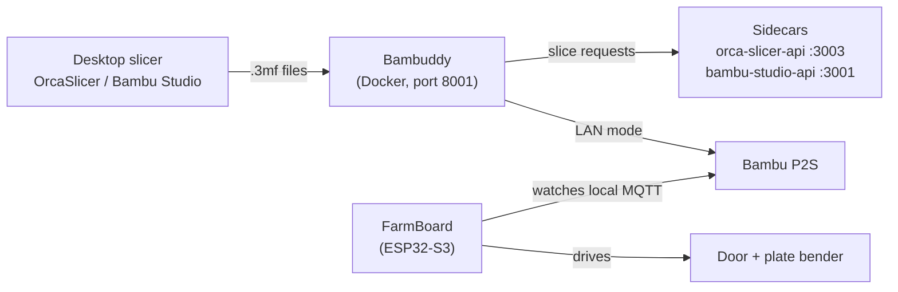

# p2s-autofarm

**A self-hosted, hands-off print farm for the Bambu Lab P2S: queueing, server-side slicing, and automatic part ejection, all on your LAN with no cloud required.**

Free to use, fork, and build on for individuals, hobbyists, and small shops (see [License](#license)).

> **Unofficial community guide.** Not affiliated with or endorsed by Bambu Lab, 3D Farmers, or the Bambuddy project. All product names are trademarks of their owners. Anything that moves the toolhead or bends the build plate can damage your printer. Test every change slowly while watching the machine, and use this guide at your own risk.

> **DRAFT:** items marked **TODO** need your own photos, measurements, or a status check before publishing.

---

## What this is

A working setup (and a list of the gotchas) for running a Bambu Lab P2S as an unattended print farm:

- **Bambuddy** for queueing, archiving and print management, self-hosted in Docker
- **Slicer sidecars** (OrcaSlicer and Bambu Studio APIs) for slicing on the server
- **FarmLoop Stage 2** hardware for automatic door opening and plate bending to eject finished parts
- **Everything over local network**: LAN-only mode, Developer Mode, local MQTT

Built and tested on a P2S with AMS 2 Pro. Much of it should carry over to other Bambu printers, but the P2S has quirks (see [Troubleshooting](#troubleshooting)).

## Tested with

| Component | Version |
|---|---|
| Printer | Bambu Lab P2S + AMS 2 Pro |
| Bambuddy | 1.2.5.5 |
| FarmBoard firmware | 2.94 |
| FarmLoop app | 2.72 (states it is tested up to Bambu Studio 2.6) |
| Server | Ubuntu, x86_64, headless, Docker Compose |

> **TODO:** update these to whatever you're running when you publish.

## Architecture

The FarmBoard does **not** run on custom G-code alone. It connects to the printer's local MQTT broker, watches print progress, and fires its own door and bender motors when it sees timing markers that were embedded in the print file. That is why LAN-only mode and Developer Mode are required, and why processed files must not be renamed or re-saved.

## What's running today

Bambuddy and the OrcaSlicer sidecar are live on a headless Ubuntu box, queueing and archiving prints sent from OrcaSlicer over the LAN. The FarmLoop Stage 2 board is wired into the printer's local MQTT and handles door/bender ejection (bender is unused as it props open the bottom of the p2s printer so i took it out and I just use an engineering plate which releases bellow 30°C) on `FL_S2_`-processed files. The Bambu Studio sidecar and full end-to-end ejection timing are still being confirmed — see [status and troubleshooting](troubleshooting/README.md) if you're building this yourself and want the details.

## Guide contents

For people who want to build this themselves — the full setup, in the order you'd actually do it:

1. **[hardware-setup/](hardware-setup/README.md)** — printer network prep, FarmLoop Stage 2 board assembly, and part-detachment/ejection tuning.
2. **[software-setup/](software-setup/README.md)** — Bambuddy, the slicer sidecars, and the desktop slicer.
3. **[gcode-snippets/](gcode-snippets/README.md)** — known-good G-code fixes injected into prints for the ejection cycle.
4. **[air-quality-and-ventilation/](air-quality-and-ventilation/README.md)** — keeping fumes and particulates out of the room while the farm runs unattended.
5. **[troubleshooting/](troubleshooting/README.md)** — symptom/fix table and the detailed per-component status, for when something doesn't work.

## Alternatives

- **SimplyPrint** offers a FarmLoop AutoPrint integration, but it moved behind its paid Pro plan after its free beta.
- **FarmLoop Pro app** does not work as intended. See [FL_S2_INCIDENT.md](FL_S2_INCIDENT.md).

## Keep out of your fork or PR

Never commit your LAN access code, printer serial number, real IP addresses or Wi-Fi credentials. Also leave out vendor firmware binaries and app-generated files. Use placeholders such as `<PRINTER_IP>` and `<ACCESS_CODE>` in anything you share.

## Contributing

Corrections and other-printer notes are welcome. Open an issue or PR with the printer model, firmware version and what you tested.

## License

[Polyform Small Business License 1.0.0](LICENSE) — free to use, modify, and redistribute (including commercially) for individuals, nonprofits, and small businesses. Larger companies should contact the maintainer about separate terms rather than assume the free grant applies.

## Credits

- [Bambuddy](https://github.com/maziggy/bambuddy) by maziggy -- what a framework!
- 3D Farmers (FarmLoop) documentation and community
- Claude for G-code

